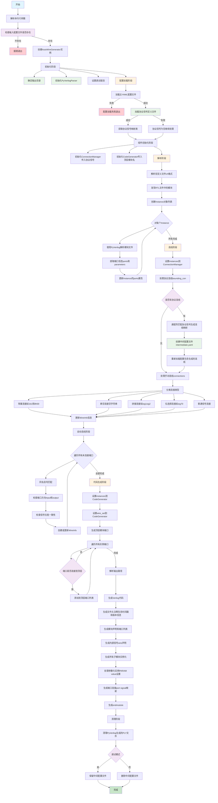
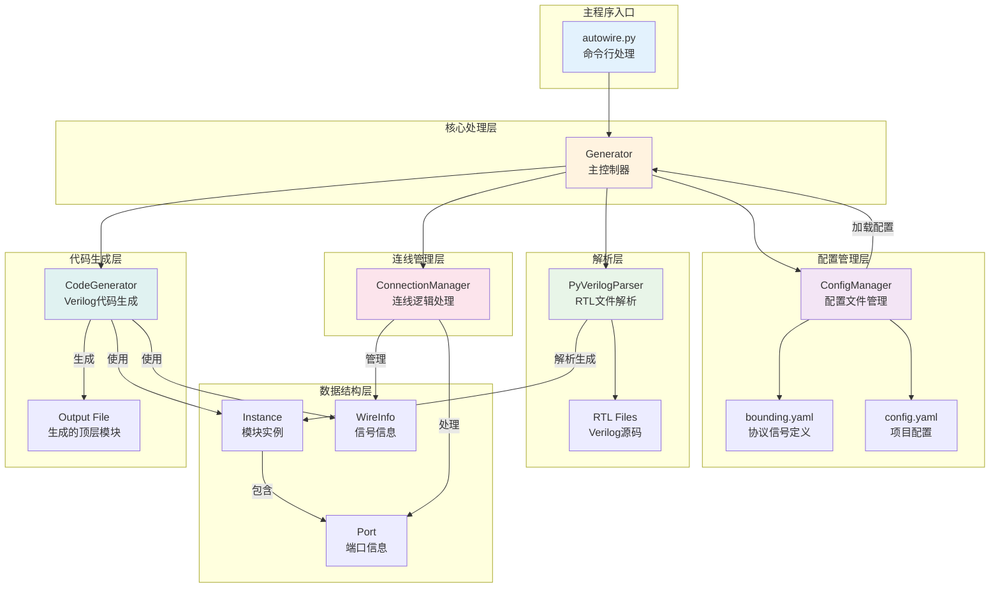
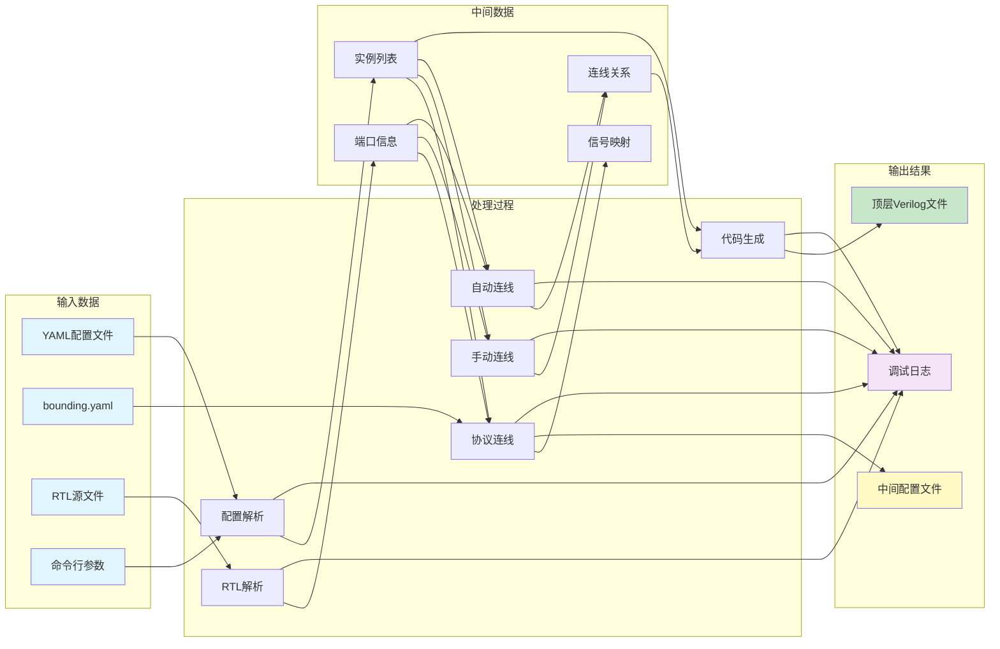

# AutoWire v2.0

[](https://opensource.org/licenses/MIT)
[](https://www.python.org/)

AutoWire v2.0 是一个基于 [PyVerilog](https://github.com/PyHDI/Pyverilog) 的 Verilog SOC 自动连线工具。它能够自动解析 Verilog 模块，根据配置文件进行协议信号批量匹配和端口连线，最终生成顶层集成模块。

## 特性

- 🔧 **自动连线**: 同名匹配原则，支持基于协议信号的自动连线（AHB、AXI、APB、自定义信号组等）
- 📝 **灵活配置**: 使用 YAML 配置文件进行模块定义和连线配置
- 🎯 **精确解析**: 基于 PyVerilog 进行准确的 Verilog 语法解析
- 🔄 **增量生成**: 支持中间配置文件生成，便于调试和验证
- 📊 **详细日志**: 提供完整的解析和连线过程日志
- 🛠️ **高级特性**: 支持模块参数化实例、条件编译等

## 安装要求

- Python 3.7+
- PyVerilog
- PyYAML

```bash
pip install pyverilog pyyaml
```

## 快速开始

### 1. 基本用法

```bash
python autowire.py -i vcn.yaml -b bounding.yaml -o output/
```

### 2. 配置文件示例

创建一个 YAML 配置文件（例如 `test.yaml`）：

```yaml
top_module: soc_top

# Global Define files (optional)  
define_files: 
  - ./autowire/rtl/define.vh
#  - ./rtl/global_define.vh

# Module definitions
rtl_path:
  - ./autowire/rtl/irqqqq.sv
  - ./autowire/rtl/cpu_core.v
  - ./autowire/rtl/uart_controller.v

# inst declare
instances:
  - module: cpu_core
    name: u_cpu
    parameters:

  - module: irqqqq
    name: u_irqqqq

  - module: uart_controller
    name: u_uart
    parameters:
      BAUD_RATE: 9600
      DATA_BITS: 16

##sub_moduel con
connections:
  u_cpu.a_hready : hready_out
  u_cpu.irq      : "{6'b0,irq[0],uart_irq}"
  u_uart.hsel_ahb: 1'b1
  u_cpu.test_in  : irq[1:0]
  u_uart.test_out:

##signal group con
bounding_con:
  - ahb:
      u_cpu.a_*    : cpu_ahbm_*
      u_uart.*_ahb  :  cpu_ahbm_*
```

### 3. 输出文件

AutoWire 会生成标准的 Verilog 顶层模块文件，包含：

1. **模块声明**: 包含所有外部端口
2. **线网声明**: 内部连接线声明
3. **实例化**: 所有子模块的实例化代码
4. **注释**: 自动生成的时间戳和工具信息

生成的代码示例：

```verilog
// -----------------------------------------------------------------------------
// File      : soc_top.v
// Brief     : Auto-generated by autowire.py v2.0
// Author    : czz
// Date      : 2025-08-25 10:24:52
// -----------------------------------------------------------------------------

module soc_top(
    // u_cpu ports
    input          clk,
    input          rst_n,
    output  [2:0]  cpu_ahbm_hsize,
    output  [2:0]  cpu_ahbm_hburst,
    input          hready_out,
    input          debug_mode,

    // u_uart ports
    output         cpu_ahbm_hready_out,
    output         tx,
    input          rx
);

wire  [15:0]  cpu_ahbm_haddr ;
wire  [31:0]  cpu_ahbm_hrdata;
wire          cpu_ahbm_hresp ;
wire  [1:0]   cpu_ahbm_htrans;
wire  [31:0]  cpu_ahbm_hwdata;
wire          cpu_ahbm_hwrite;
wire  [7:0]   irq            ;
wire  [7:0]   uart_irq       ;

// Instance: u_cpu (cpu_core)
cpu_core u_cpu (
    .clk            (clk                   ),    // input 
    .rst_n          (rst_n                 ),    // input 
    .a_haddr        (cpu_ahbm_haddr        ),    // output [15:0]
    .a_hwdata       (cpu_ahbm_hwdata       ),    // output [31:0]
    .a_hrdata       (cpu_ahbm_hrdata       ),    // input  [31:0]
    .a_hwrite       (cpu_ahbm_hwrite       ),    // output
    .a_htrans       (cpu_ahbm_htrans       ),    // output [1:0]
    .a_hsize        (cpu_ahbm_hsize        ),    // output [2:0]
    .a_hburst       (cpu_ahbm_hburst       ),    // output [2:0]
    .a_hready       (hready_out            ),    // input 
    .a_hresp        (cpu_ahbm_hresp        ),    // input 
    .debug_mode     (debug_mode            ),    // input 
    .test_in        (irq[1:0]              ),    // input  [1:0]
    .irq            ({6'b0,irq[0],uart_irq})     // input  [7:0]
);

// Instance: u_irqqqq (irqqqq)
irqqqq u_irqqqq (
    .clk            (clk                   ),    // input 
    .rst_n          (rst_n                 ),    // input 
    .irq            (irq[1:0]              )     // output [1:0]
);

// Instance: u_uart (uart_controller)
uart_controller #(
    .BAUD_RATE(9600)
    .DATA_BITS(16)
) u_uart (
    .clk            (clk                   ),    // input 
    .rst_n          (rst_n                 ),    // input 
    .haddr_ahb      (cpu_ahbm_haddr        ),    // input  [15:0]
    .hwdata_ahb     (cpu_ahbm_hwdata       ),    // input  [31:0]
    .hrdata_ahb     (cpu_ahbm_hrdata       ),    // output [31:0]
    .hwrite_ahb     (cpu_ahbm_hwrite       ),    // input 
    .htrans_ahb     (cpu_ahbm_htrans       ),    // input  [1:0]
    .hsel_ahb       (1'b1                  ),    // input 
    .hready_out_ahb (cpu_ahbm_hready_out   ),    // output
    .hresp_ahb      (cpu_ahbm_hresp        ),    // output
    .tx             (tx                    ),    // output
    .rx             (rx                    ),    // input 
    .test_out       (                      ),    // output [15:0]
    .uart_irq       (uart_irq[0]           )     // output
);

endmodule
```

## 工作原理

AutoWire v2.0 采用模块化架构，主要包含以下组件：

### 核心模块

1. **Generator (`generator.py`)**: 主控制器，协调各模块工作流程
2. **Config Manager (`config_manager.py`)**: 配置文件加载和管理
3. **Parser (`parser.py`)**: 基于 PyVerilog 的 Verilog 代码解析
4. **Connection Manager (`connection_manager.py`)**: 连线逻辑处理
5. **Code Generator (`code_generator.py`)**: 顶层模块代码生成

### 详细处理流程图



### 核心处理逻辑详解

#### 1. **协议信号匹配算法**
- 支持通配符模式匹配（如：`u_cpu.a_*` 匹配 `a_haddr`, `a_hwrite` 等）
- 基于协议信号列表进行精确过滤（AHB、AXI、APB等）
- 自动生成目标信号名称（如：`a_haddr` → `cpu_ahbm_haddr`）

#### 2. **连线优先级**
1. **协议连线** (`bounding_con`) - 最高优先级，自动生成
2. **手动连线** (`connections`) - 覆盖协议连线
3. **自动连线** - 同名信号匹配，最低优先级

#### 3. **信号类型处理**
- **常量信号**: `1'b1`, `8'hFF` 等
- **拼接信号**: `{signal1, signal2, 6'b0}`
- **位选择**: `signal[7:0]`, `bus[15:8]`
- **悬空信号**: 空连接，生成悬空端口

#### 4. **错误检测机制**
- 端口位宽不匹配检测
- 多驱动信号检测
- 模块文件不存在检测
- 语法错误捕获和报告

### 工作流程总结

1. **配置加载**: 解析 YAML 配置文件和协议信号定义
2. **模块解析**: 使用 PyVerilog 解析 RTL 文件，提取端口和参数信息
3. **连线处理**: 
   - 处理协议信号连线（基于通配符匹配和信号列表过滤）
   - 处理手动连线配置（支持复杂表达式）
   - 执行自动连线（同名信号匹配）
4. **代码生成**: 生成顶层模块 Verilog 代码，包含完整的模块实例化和信号连接

## 命令行选项

```
usage: autowire.py [-h] [-i INPUT] [-o OUTPUT] [-b BOUNDING] [-d] [--version]

AutoWire v2.0 - Verilog SOC Integration Tool (Refactored)

optional arguments:
  -h, --help            show this help message and exit
  -i INPUT, --input INPUT
                        Input YAML configuration file (default: vcn.yaml)
  -o OUTPUT, --output OUTPUT
                        Output directory or .v/.sv file path (default: .)
  -b BOUNDING, --bounding BOUNDING
                        Protocol signals definition file (default: bounding.yaml)
  -d, --debug           Enable debug output
  --version             show program version number and exit
```

## 使用示例

```bash
# 指定配置文件和输出目录
python autowire.py -i soc_config.yaml -b bounding.yaml -o build/

# 指定配置文件、bounding信号、输出目录
python autowire.py -i soc_config.yaml -b bounding.yaml -o build/

# 指定输出文件
python autowire.py -i soc_config.yaml -b bounding.yaml -o build/soc_top.v

# 开启调试模式
python autowire.py -i soc_config.yaml -b bounding.yaml -o build/soc_top.v -d
```

## 配置文件详细说明

### 主配置文件结构 (YAML)

```yaml
# 基本配置
top_module: soc_top                    # 生成的顶层模块名

# 宏定义文件 (可选)
define_files:                          # 全局宏定义文件列表
  - ./rtl/define.vh
  - ./rtl/global_define.vh

# RTL源文件
rtl_path:                              # RTL文件路径列表
  - ./rtl/cpu_core.v
  - ./rtl/uart_controller.v
  - ./rtl/memory_controller.v

# 模块实例定义
instances:
  - module: cpu_core                   # 模块名（必须）
    name: u_cpu                        # 实例名（必须）
    parameters:                        # 参数化配置（可选）
      CACHE_SIZE: 1024
      ADDR_WIDTH: 32
      
  - module: uart_controller
    name: u_uart
    parameters:
      BAUD_RATE: 115200
      DATA_BITS: 8

# 手动连线配置
connections:
  # 格式：实例名.端口名: 连接目标
  u_cpu.clk: clk                       # 普通信号连接
  u_cpu.reset_n: rst_n                 # 信号重命名连接
  u_cpu.interrupt: "{timer_irq, uart_irq, 6'b0}"  # 信号拼接
  u_uart.enable: 1'b1                  # 常量连接
  u_uart.test_mode: 2'b01              # 多位常量
  u_debug.probe:                       # 悬空连接（留空）

# 协议信号批量连线
bounding_con:
  - ahb:                               # AHB协议连线
      u_cpu.ahb_*: cpu_ahbm_*          # 通配符匹配
      u_memory.*_ahb: cpu_ahbm_*       # 后缀匹配
      
  - axi:                               # AXI协议连线  
      u_dma.axi_*: system_axi_*
      
  - apb:                               # APB协议连线
      u_timer.*_apb: apb_*
```

### 协议信号定义文件 (bounding.yaml)

```yaml
# 协议信号定义，用于通配符匹配时的信号识别
protocol_signals:
  ahb:                                 # AHB协议信号列表
    - haddr                            # 只有包含这些信号名的端口
    - hwdata                           # 才会被协议连线匹配
    - hrdata
    - hwrite
    - htrans
    - hsize
    - hburst
    - hready
    - hresp
    - hsel
    
  axi:                                 # AXI协议信号列表
    - awaddr
    - awvalid
    - awready
    - wdata
    - wvalid
    - wready
    - bresp
    - bvalid
    - bready
    # ... 更多AXI信号
    
  apb:                                 # APB协议信号列表
    - paddr
    - pwdata
    - prdata
    - pwrite
    - psel
    - penable
    - pready
```

### 配置文件解析优先级

1. **协议连线** (`bounding_con`) - 自动生成，最低优先级
2. **手动连线** (`connections`) - 手动配置，会覆盖协议连线
3. **自动连线** - 同名信号匹配，填补未连接端口

### 连接类型支持

| 连接类型 | 语法示例 | 说明 |
|---------|---------|------|
| 普通信号 | `signal_name` | 直接信号连接 |
| 常量连接 | `1'b1`, `8'hFF` | 常量值连接 |
| 信号拼接 | `{sig1, sig2, 4'b0}` | 多信号拼接 |
| 位选择 | `bus[7:0]`, `data[15]` | 信号位选择 |
| 悬空连接 | (留空) | 端口悬空不连接 |

## 高级功能

### 通配符连线

支持使用通配符进行批量连线：

```yaml
bounding_con:
  - ahb:
      u_master.ahb_*: master_ahb_*      # 匹配所有 ahb_ 开头的端口
      u_slave.*_ahb: slave_ahb_*        # 匹配所有 _ahb 结尾的端口
```

### 参数化实例

支持为实例指定参数：

```yaml
instances:
  - module: memory_controller
    name: u_memory
    parameters:
      ADDR_WIDTH: 32
      DATA_WIDTH: 64
      CACHE_LINES: 256
```

### 信号拼接

支持复杂的信号连接表达式：

```yaml
connections:
  u_cpu.interrupt: "{irq_timer, irq_uart, 6'b0}"
  u_mux.select: "2'b01"
  u_module.data_out:                    # 悬空连接
```

## 故障排除和最佳实践

### 常见问题及解决方案

#### 1. **模块解析失败**
```bash
# 错误示例
ERROR - Module cpu_core not found in RTL files
```
**解决方案：**
- 检查 `rtl_path` 中的文件路径是否正确
- 确认模块名与 Verilog 文件中的 `module` 声明一致
- 使用绝对路径避免相对路径问题
- 检查文件是否存在且可读

#### 2. **协议信号不匹配**
```bash
# 错误示例  
WARNING - No protocol signals matched for u_cpu.ahb_*
```
**解决方案：**
- 检查端口命名是否包含协议信号名（如 `haddr`, `hwrite` 等）
- 验证 `bounding.yaml` 中的协议信号定义
- 使用调试模式 `-d` 查看详细匹配过程
- 确认通配符模式正确（如 `ahb_*` vs `*_ahb`）

#### 3. **位宽不匹配警告**
```bash
# 警告示例
WARNING - Width mismatch for wire data_bus: input=32, output=16
```
**解决方案：**
- 检查连接的两个端口位宽是否匹配
- 使用位选择语法：`data_bus[15:0]` 连接到16位端口
- 使用拼接语法：`{16'b0, narrow_signal}` 扩展位宽
- 修改模块定义确保位宽一致

#### 4. **多驱动信号错误**
```bash
# 错误示例
ERROR - Multiple outputs driving wire clock_signal
```
**解决方案：**
- 检查是否有多个输出端口连接到同一信号
- 使用不同的信号名区分不同来源
- 检查配置文件中是否有重复连线定义

### 最佳实践建议

#### 1. **文件组织**
```
project/
├── config/
│   ├── soc.yaml           # 主配置文件
│   └── protocols.yaml     # 协议定义文件
├── rtl/
│   ├── cpu/               # 按功能模块分类
│   ├── memory/
│   └── peripherals/
└── generated/
    └── soc_top.v          # 生成的顶层文件
```

#### 2. **命名规范**
```yaml
# 推荐的端口命名规范
instances:
  - name: u_cpu_core       # 实例名添加 u_ 前缀
  - name: u_ahb_decoder    # 协议相关模块包含协议名
  - name: u_uart_0         # 多个同类模块添加序号
```

#### 3. **协议连线最佳实践**
```yaml
# 清晰的协议连线配置
bounding_con:
  - ahb:
      # 主设备连接
      u_cpu.ahb_*: cpu_ahb_*
      u_dma.ahb_*: dma_ahb_*
      
      # 从设备连接  
      u_memory.*_ahb: ahb_slave_*
      u_uart.*_ahb: ahb_slave_*
```

#### 4. **调试技巧**
```bash
# 逐步调试流程
python autowire.py -i config.yaml -o test/ -d > debug.log 2>&1

# 检查中间文件
ls test/*_intermediate.yaml

# 验证生成的代码
iverilog -o sim test/soc_top.v rtl/*.v
```

#### 5. **性能优化**
- 将常用的RTL文件放在SSD上加速解析
- 使用相对路径避免长路径名
- 合理组织协议信号列表，常用协议放在前面
- 对大型项目考虑分模块配置，减少单次解析文件数量

#### 6. **版本控制建议**
```gitignore
# .gitignore 示例
*_intermediate.yaml    # 中间配置文件
*.pyc                  # Python缓存文件  
parsetab.py           # PyVerilog解析缓存
parser.out            # PLY生成文件
generated/            # 生成的文件目录（可选）
```

#### 7. **配置文件维护**
```yaml
# 使用注释组织配置文件
##############################################
# CPU 子系统实例
##############################################
instances:
  - module: cpu_core
    name: u_cpu
    parameters:
      # 缓存配置
      ICACHE_SIZE: 8192
      DCACHE_SIZE: 8192
      
##############################################  
# 手动连线 - 系统级信号
##############################################
connections:
  # 时钟和复位
  u_cpu.clk: sys_clk
  u_cpu.rst_n: sys_rst_n
  
  # 中断连接
  u_cpu.irq: "{timer_irq, uart_irq, 30'b0}"
```

### 错误恢复策略

1. **备份原始配置**: 修改配置前先备份
2. **渐进式调试**: 从简单配置开始，逐步添加复杂连线
3. **模块化验证**: 单独验证每个子系统后再整合
4. **日志分析**: 利用调试日志定位问题根源
5. **版本对比**: 使用版本控制工具对比配置变更

### 调试模式

使用 `-d` 选项可以查看详细的执行过程：

```bash
autowire.py -i ./vcn.yaml -b bounding.yaml -o ./out -d
```

调试模式下会显示：
- 文件解析过程
- 端口匹配详情
- 连线生成信息
- 中间配置文件路径

#### DEBUG信息示例
```
python autowire.py -i ./vcn.yaml -b bounding.yaml -o ./out -d

2025-08-25 15:38:25 - INFO    - src.generator          - Starting SOC generation with new architecture...
2025-08-25 15:38:25 - INFO    - src.generator          - Loading configurations...
2025-08-25 15:38:25 - INFO    - src.config_manager     - Loaded configuration from ./vcn.yaml
2025-08-25 15:38:25 - INFO    - src.config_manager     - Loaded protocol signals from D:\work\autowire\bounding.yaml
2025-08-25 15:38:25 - INFO    - src.generator          - Parsing phase...
2025-08-25 15:38:25 - INFO    - src.parser             - Registered 1 define files
2025-08-25 15:38:25 - INFO    - src.generator          - Parsed 0 global defines
2025-08-25 15:38:25 - INFO    - src.generator          - Found 3 modules in RTL files
Generating LALR tables
WARNING: 183 shift/reduce conflicts
2025-08-25 15:38:26 - INFO    - src.parser             - Successfully parsed module cpu_core with 14 ports
Generating LALR tables
WARNING: 183 shift/reduce conflicts
2025-08-25 15:38:28 - INFO    - src.parser             - Successfully parsed module irqqqq with 3 ports
Generating LALR tables
WARNING: 183 shift/reduce conflicts
2025-08-25 15:38:29 - INFO    - src.parser             - Successfully parsed module uart_controller with 14 ports
2025-08-25 15:38:29 - INFO    - src.generator          - Connection phase...
2025-08-25 15:38:29 - INFO    - src.connection_manager - Processing protocol connections...
2025-08-25 15:38:29 - INFO    - src.connection_manager - Generated 17 protocol connections
2025-08-25 15:38:29 - INFO    - src.config_manager     - Created intermediate YAML file: D:\work\autowire\out\vcn_intermediate.yaml
2025-08-25 15:38:30 - INFO    - src.config_manager     - Loaded configuration from D:\work\autowire\out\vcn_intermediate.yaml
2025-08-25 15:38:30 - INFO    - src.connection_manager - Processing 20 manual connections
2025-08-25 15:38:30 - WARNING - src.connection_manager - Input width mismatch for irq: 8 vs 2
2025-08-25 15:38:30 - INFO    - src.connection_manager - Starting auto-connection of unconnected ports
2025-08-25 15:38:30 - INFO    - src.connection_manager - Auto-connection completed: 31/31 ports connected
2025-08-25 15:38:30 - INFO    - src.connection_manager - Total wires in wire_set: 17
2025-08-25 15:38:30 - INFO    - src.generator          - Code generation phase...
2025-08-25 15:38:30 - INFO    - src.code_generator     - Generating top-level ports in instance and port definition order
2025-08-25 15:38:30 - INFO    - src.code_generator     - Generated 9 top-level ports
2025-08-25 15:38:30 - INFO    - src.code_generator     - Generating top module to ./out\soc_top.v
2025-08-25 15:38:30 - WARNING - src.code_generator     - Width mismatch for wire irq: input=8, output=2, using max=8
2025-08-25 15:38:30 - WARNING - src.code_generator     - Width mismatch for wire uart_irq: input=8, output=1, using max=8
2025-08-25 15:38:30 - INFO    - src.code_generator     - Successfully generated ./out\soc_top.v
2025-08-25 15:38:30 - INFO    - src.generator          - Debug mode: keeping intermediate file D:\work\autowire\out\vcn_intermediate.yaml
2025-08-25 15:38:30 - INFO    - src.generator          - Generation completed successfully!
2025-08-25 15:38:30 - INFO    - __main__               - AutoWire v2.0 completed successfully!
```

## 项目架构

### 模块关系架构图



### 数据流向图



## 项目结构

```
autowire-master/
├── autowire.py              # 主入口脚本
├── bounding.yaml           # 协议信号定义
├── test.yaml              # 示例配置文件
├── vcn.yaml               # 另一个配置文件示例
├── LICENSE                # MIT 许可证
├── src/                   # 核心源代码
│   ├── __init__.py
│   ├── generator.py       # 主生成器
│   ├── config_manager.py  # 配置管理
│   ├── parser.py          # Verilog解析器
│   ├── connection_manager.py  # 连线管理
│   ├── code_generator.py  # 代码生成
│   ├── data_structures.py # 数据结构定义
│   └── logger.py          # 日志管理
├── rtl/                   # RTL 文件目录
└── test_output_v2/        # 输出示例
```

## 贡献

欢迎提交 Issue 和 Pull Request！

## 许可证

本项目基于 MIT 许可证开源。详见 [LICENSE](LICENSE) 文件。

## 更新日志

### v2.0.0 (重构版本)
- 完全重构代码架构，提高可维护性
- 优化协议信号匹配算法
- 增强错误处理和日志输出
- 支持更灵活的配置选项
- 改进代码生成质量

---

## 待办
- 将[dma_controller](https://github.com/czz-zzc/dma_controller)作为example展示
- 支持parameter延申至top
- 支持二维数组类port自动连线

**技术支持**: 如有问题请提交 GitHub Issue
