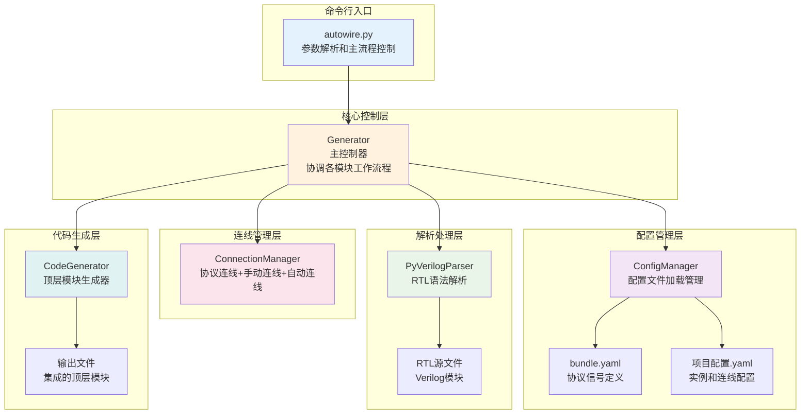
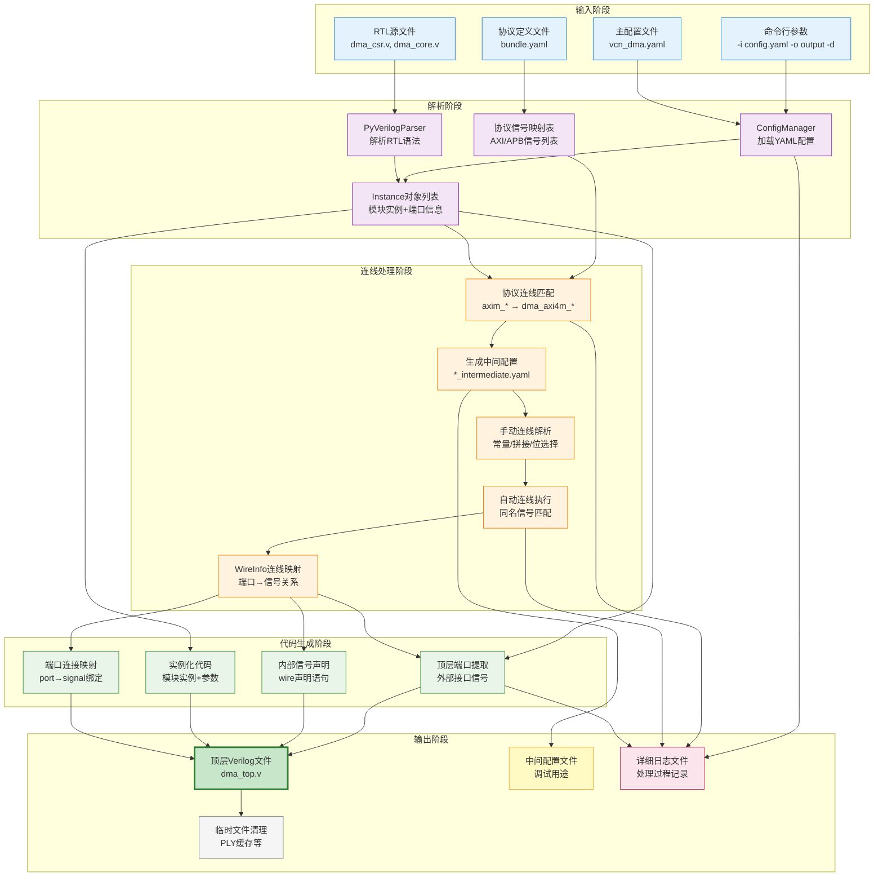

# AutoWire
[](https://opensource.org/licenses/MIT)
[](https://www.python.org/)

AutoWire 是一个基于 [PyVerilog](https://github.com/PyHDI/Pyverilog) 的 Verilog 自动连线工具。它能够自动解析 Verilog 模块，根据配置文件进行协议信号批量匹配和端口连线，最终生成顶层模块，适应于soc集成。

# 架构图



## 核心特性

- 🔧 **智能连线**: 协议信号自动识别（AXI、APB、AHB等）+ 同名信号匹配
- 📝 **YAML配置**: 直观的配置文件，支持参数化实例和复杂连接表达式  
- 🎯 **精确解析**: 基于 PyVerilog 的语法解析，支持二维数组端口、宏定义处理等
- 🔌 **信号输出**: 将内部信号暴露为顶层输出端口，便于调试和监控
- 🐛 **调试友好**: 详细日志输出，中间配置文件保存，临时文件可选保留
- 🚀 **模块化架构**: 重构后的 v2.0 版本，组件化设计便于扩展


## 安装依赖

```bash
pip install pyverilog pyyaml
```
其他：pyverilog需要预装iverilog,否则解析错误


## 快速开始 - DMA 控制器集成示例

以 DMA 控制器为例，演示 AutoWire v2.0 的完整使用流程：

### 1. 准备RTL文件

项目包含两个核心模块：
- `dma_csr.v`: DMA 配置寄存器模块（APB从设备接口）
- `dma_core.v`: DMA 数据传输核心模块（AXI主设备接口）

### 2. 创建配置文件 `vcn_dma.yaml`

```yaml
top_module: dma_top

# RTL 源文件路径
rtl_path:
  - ./dma_rtl/dma_csr.v
  - ./dma_rtl/dma_core.v

# 模块实例定义
instances:
  - module: dma_csr
    name: u_dma_csr
  - module: dma_core
    name: u_dma_core
    parameters:
      DMA_NUM_DESC: 2          # 参数化配置：2个描述符

# 手动连线（常量连接）
connections:
  u_dma_csr.csr_dma_version: 16'habcd  # DMA版本号

# 协议信号自动连线
bundle_con:
  - axi:                       # AXI4协议信号批量连接
      u_dma_core.axim_*: dma_axi4m_*
  - apb:                       # APB协议信号批量连接  
      u_dma_csr.*: dma_apbs_*

# 内部信号顶层输出 (新功能)
top_add:
  - csr_dma_done                    # 将内部信号输出到顶层
  - csr_dma_err                     # DMA错误状态信号
```

### 3. 运行AutoWire

```bash
python autowire.py -i vcn_dma.yaml -o ./dma_rtl_gen -d
```

参数说明：
- `-i vcn_dma.yaml`: 指定输入配置文件
- `-o ./dma_rtl_gen`: 指定输出目录
- `-d`: 启用调试模式，生成详细日志

### 4. 输出结果

AutoWire 自动生成以下文件：

#### 顶层模块 `dma_top.v`：
```verilog
module dma_top(
    // APB从设备接口（CSR模块）
    input           pclk,
    input           presetn,
    input           dma_apbs_psel,
    input           dma_apbs_penable,
    input           dma_apbs_pwrite,
    input   [11:0]  dma_apbs_paddr,
    input   [31:0]  dma_apbs_pwdata,
    output  [31:0]  dma_apbs_prdata,
    output          dma_apbs_pready,

    // AXI4主设备接口（数据传输）
    input           clk,
    input           rst_n,
    output  [31:0]  dma_axi4m_awaddr,
    output  [7:0]   dma_axi4m_awlen,
    // ... 完整的AXI4信号

    // top_add输出端口（内部信号暴露）
    output          csr_dma_done,              // DMA完成状态
    output          csr_dma_err                // DMA错误状态  
);

// 内部连线信号（自动声明）
wire  [31:0]  csr_desc_src_addr [1:0];     // 数组信号
wire  [31:0]  csr_desc_dst_addr [1:0]; 
wire  [7:0]   csr_dma_maxburst;
// ... 更多内部信号

// CSR模块实例化
dma_csr u_dma_csr (
    .pclk              (pclk               ),
    .presetn           (presetn            ),
    .psel              (dma_apbs_psel      ),
    .csr_dma_version   (16'habcd           ),  // 常量连接
    // ... APB协议信号自动连接
);

// DMA核心模块实例化（参数化）
dma_core #(
    .DMA_NUM_DESC(2)        // 参数自动传递
) u_dma_core (
    .clk               (clk                ),
    .rst_n             (rst_n              ),
    .axim_awaddr       (dma_axi4m_awaddr   ),
    // ... AXI协议信号自动连接
    .csr_desc_src_addr (csr_desc_src_addr  ), // 内部信号连接
);

endmodule
```

### 5. 关键特性演示

✅ **协议信号自动识别**: 
- `axim_*` → `dma_axi4m_*` (36个AXI信号)
- `psel, paddr, pwdata...` → `dma_apbs_*` (7个APB信号)

✅ **数组端口支持**: 
- `csr_desc_src_addr[1:0]` 正确处理

✅ **参数化实例**: 
- `DMA_NUM_DESC: 2` 自动传递到模块

✅ **常量连接**: 
- 版本号 `16'habcd` 直接连接

✅ **自动连线**: 
- 81个端口全部自动连接，无需手动配置

✅ **内部信号输出**: 
- `top_add` 配置将内部信号暴露为顶层输出端口
- 支持标量和数组信号，位置自动排列在端口列表末尾

### 6. 调试信息

调试模式下生成详细日志：
```
2025-09-03 19:54:31 - INFO - Generated 44 protocol connections
2025-09-03 19:54:31 - INFO - Auto-connection completed: 81/81 ports connected
2025-09-03 19:54:31 - INFO - Processing top_add signals: ['csr_dma_done', 'csr_dma_err']  
2025-09-03 19:54:31 - INFO - Generated 51 top-level ports (including 3 top_add ports)
2025-09-03 19:54:31 - INFO - Successfully generated ./dma_rtl_gen\dma_top.v
```

## 系统架构


### 处理流程图

```mermaid
flowchart TD
    A[开始] --> B[解析命令行参数<br/>-i config.yaml -o output -d]
    B --> C{检查输入文件存在?}
    C -->|否| C1[❌ 报错退出<br/>文件不存在]
    C -->|是| D[初始化AutoWireGenerator<br/>设置调试模式]
    
    D --> E[📂 配置加载阶段]
    E --> E1[加载主YAML配置<br/>解析instances/connections]
    E1 --> E2{协议定义文件存在?}
    E2 -->|是| E2A[加载bundle.yaml<br/>解析AXI/APB/AHB信号]
    E2 -->|否| E2B[跳过协议定义<br/>仅使用手动连线]
    E2A --> E3[初始化各组件<br/>ConnectionManager/CodeGenerator]
    E2B --> E3
    
    E3 --> F[🔍 RTL解析阶段]
    F --> F1[扫描rtl_path<br/>发现Verilog模块文件]
    F1 --> F2[创建Instance对象列表<br/>基于instances配置]
    F2 --> F3{遍历每个Instance}
    F3 --> F4[使用PyVerilog解析模块<br/>提取端口和参数信息]
    F4 --> F4A[处理数组端口<br/>如csr_desc_addr数组]
    F4A --> F4B[应用参数化配置<br/>如DMA_NUM_DESC: 2]
    F4B --> F5[更新Instance端口列表<br/>Port对象集合]
    F5 --> F3
    F3 -->|全部完成| G[🔗 连线处理阶段]
    
    G --> G1[协议连线处理<br/>bundle_con规则]
    G1 --> G1A[通配符匹配展开<br/>axim_* → 匹配所有axim_开头端口]
    G1A --> G1B[协议信号过滤<br/>基于bundle.yaml信号列表]
    G1B --> G1C[生成协议连接映射<br/>axim_awaddr → dma_axi4m_awaddr]
    G1C --> G1D[创建中间配置文件<br/>*_intermediate.yaml]
    
    G1D --> G2[手动连线处理<br/>connections配置]
    G2 --> G2A{连线类型判断}
    G2A -->|常量| G2A1[处理常量连接<br/>16'habcd, 1'b1]
    G2A -->|位选择| G2A2[处理位选择<br/>signal数组]
    G2A -->|拼接| G2A3[处理信号拼接<br/>]
    G2A -->|悬空| G2A4[处理悬空端口<br/>留空不连接]
    G2A1 --> G2B[更新WireInfo映射]
    G2A2 --> G2B
    G2A3 --> G2B
    G2A4 --> G2B
    
    G2B --> G3[自动连线阶段<br/>同名信号匹配]
    G3 --> G3A{遍历未连接端口}
    G3A --> G3B[查找同名端口<br/>不同实例间]
    G3B --> G3C{端口方向检查}
    G3C -->|input-output匹配| G3D[检查位宽一致性]
    G3C -->|方向不匹配| G3A
    G3D -->|位宽匹配| G3E[创建自动连线<br/>更新WireInfo]
    G3D -->|位宽不匹配| G3F[⚠️ 记录警告信息<br/>继续处理]
    G3E --> G3A
    G3F --> G3A
    G3A -->|全部处理完成| H[📝 代码生成阶段]
    
    H --> H1[生成顶层端口列表<br/>提取对外接口信号]
    H1 --> H1A[按实例顺序处理端口<br/>保持生成顺序一致性]
    H1A --> H1B[区分input/output方向<br/>确定端口声明]
    H1B --> H2[生成内部信号声明<br/>wire语句自动生成]
    H2 --> H2A[处理数组信号声明<br/>wire数组格式]
    H2A --> H2B[避免重复声明<br/>去重处理]
    
    H2B --> H3[生成实例化代码<br/>模块实例+端口连接]
    H3 --> H3A[处理参数传递<br/>]
    H3A --> H3B[生成端口连接映射<br/>]
    H3B --> H3C[格式化代码输出<br/>对齐和注释]
    
    H3C --> H4[写入Verilog文件<br/>完整模块代码]
    H4 --> H4A[添加文件头注释<br/>时间戳和版本信息]
    H4A --> H4B[生成模块声明<br/>module top_name]
    H4B --> H4C[输出内部信号声明]
    H4C --> H4D[输出所有实例化代码]
    H4D --> H4E[添加endmodule]
    
    H4E --> I[🧹 清理和完成阶段]
    I --> I1[清理PyVerilog缓存<br/>删除PLY文件]
    I1 --> I2{调试模式启用?}
    I2 -->|是| I3[保留中间文件<br/>*_intermediate.yaml]
    I2 -->|否| I4[删除临时文件<br/>清理工作目录]
    I3 --> I5[保留详细日志<br/>*_debug_*.log]
    I4 --> I5
    I5 --> J[✅ 成功完成<br/>生成顶层模块]
    
    %% 错误处理路径
    C1 --> END[❌ 执行失败]
    F4 -->|解析错误| F_ERR[❌ RTL解析失败<br/>检查Verilog语法]
    G1C -->|匹配失败| G_WARN[⚠️ 协议信号未匹配<br/>记录警告继续]
    H4 -->|写入失败| H_ERR[❌ 文件写入失败<br/>检查权限和路径]
    
    F_ERR --> END
    G_WARN --> G2
    H_ERR --> END
    
    %% 样式定义
    style A fill:#e1f5fe,stroke:#0277bd,stroke-width:2px
    style J fill:#c8e6c9,stroke:#2e7d32,stroke-width:3px
    style END fill:#ffcdd2,stroke:#c62828,stroke-width:2px
    
    style E fill:#f3e5f5,stroke:#7b1fa2
    style F fill:#e8f5e8,stroke:#388e3c
    style G fill:#fff3e0,stroke:#f57c00
    style H fill:#e3f2fd,stroke:#1976d2
    style I fill:#f5f5f5,stroke:#757575
    
    style C1 fill:#ffcdd2,stroke:#c62828
    style F_ERR fill:#ffcdd2,stroke:#c62828
    style G_WARN fill:#fff3e0,stroke:#ff9800
    style H_ERR fill:#ffcdd2,stroke:#c62828
    
    style G1A fill:#fff8e1,stroke:#f9a825
    style G2A1 fill:#fff8e1,stroke:#f9a825
    style G3B fill:#fff8e1,stroke:#f9a825
```



### 流程关键节点说明

#### 🔍 **解析阶段关键点**
- **PyVerilog集成**: 使用industry-standard解析器确保语法准确性
- **数组端口处理**: 特殊处理`signal[1:0]`格式的端口声明
- **参数化支持**: 动态应用`parameters`配置到模块实例

#### 🔗 **连线阶段优先级**
1. **协议连线** (`bundle_con`) → 最高优先级，批量处理
2. **手动连线** (`connections`) → 中等优先级，精确控制
3. **自动连线** (同名匹配) → 最低优先级，智能补全

#### 📝 **代码生成特色**
- **顺序保持**: 按配置文件中的实例顺序生成代码
- **格式优化**: 自动对齐和添加注释，提高可读性
- **错误处理**: 位宽不匹配等问题的智能处理和警告

#### 🐛 **调试模式增强**
- **中间文件保留**: `*_intermediate.yaml`包含展开后的完整配置
- **详细日志**: 记录每个处理步骤的详细信息
- **临时文件**: 可选保留PyVerilog生成的临时解析文件

### 数据流向图



### 关键数据结构流转

#### 1. **配置数据** (YAML → Python对象)
```
vcn_dma.yaml → ConfigManager → {
    'top_module': 'dma_top',
    'instances': [Instance对象列表],
    'connections': {端口映射字典},
    'bundle_con': [协议连线规则]
}
```

#### 2. **RTL解析数据** (Verilog → 结构化信息)
```
dma_core.v → PyVerilogParser → Instance {
    'name': 'u_dma_core',
    'module': 'dma_core', 
    'ports': [Port对象列表],
    'parameters': {'DMA_NUM_DESC': 2}
}
```

#### 3. **连线映射数据** (规则 → 具体连接)
```
协议规则: u_dma_core.axim_* → dma_axi4m_*
处理结果: WireInfo {
    'wire_name': 'dma_axi4m_awaddr',
    'connections': {
        'u_dma_core.axim_awaddr': 'output[31:0]'
    }
}
```

#### 4. **代码生成数据** (映射 → Verilog代码)
```
WireInfo + Instance → CodeGenerator → 生成:
- 顶层端口声明: output [31:0] dma_axi4m_awaddr
- 实例端口连接: .axim_awaddr(dma_axi4m_awaddr)
- 内部信号声明: wire [7:0] csr_dma_maxburst
```

### 核心算法说明

#### 1. 协议信号匹配算法
- **通配符展开**: `u_dma_core.axim_*` 匹配所有 `axim_` 前缀端口
- **协议过滤**: 基于 `bundle.yaml` 中的信号列表进行精确过滤
- **命名转换**: `axim_awaddr` → `dma_axi4m_awaddr`

#### 2. 连线优先级机制
1. **协议连线** (`bundle_con`) - 最高优先级
2. **手动连线** (`connections`) - 中等优先级  
3. **自动连线** (同名匹配) - 最低优先级

#### 3. 位宽检查和错误处理
- 自动检测端口位宽不匹配
- 支持位选择语法 `signal[7:0]`
- 支持信号拼接 `{sig1, sig2, 4'b0}`

## 命令行参数

```bash
python autowire.py [-h] [-i INPUT] [-o OUTPUT] [-b BOUNDING] [-d] [--version]

参数说明:
  -h, --help            显示帮助信息并退出
  -i INPUT, --input     输入YAML配置文件 (默认: vcn.yaml)
  -o OUTPUT, --output   输出目录或文件路径 (默认: .)
  -b BOUNDING, --bounding 协议信号定义文件 (默认: bundle.yaml)  
  -d, --debug           启用调试模式，保存详细日志和中间文件
  --version             显示版本信息
```

**使用示例：**

```bash
# DMA控制器集成（推荐）
python autowire.py -i vcn_dma.yaml -o ./dma_rtl_gen -d

# CPU子系统集成，使用自定义协议文件
python autowire.py -i cpu_config.yaml -b custom_protocols.yaml -o cpu_top.v

# 快速生成，输出到当前目录
python autowire.py -i simple_config.yaml

# 调试模式，查看详细处理过程
python autowire.py -i debug_config.yaml -o ./debug -d
```

### 连接语法支持

| 连接类型 | 语法示例 | 说明 |
|---------|---------|------|
| 常量连接 | `1'b1`, `16'habcd`, `32'd100` | 直接常量值 |
| 位选择 | `bus[7:0]`, `data[15]` | 信号位选择 |
| 信号拼接 | `{sig1, sig2, 4'b0}` | 多信号拼接 |
| 悬空端口 | (留空) | 端口不连接 |
| 表达式 | `~reset_n`, `data + 1` | 简单表达式 |

## 常见问题与解决方案

### 1. 模块解析失败
```
ERROR - Module cpu_core not found in RTL files
```
**解决方案：**
- 检查 `rtl_path` 中文件路径是否正确
- 确认模块名与文件中 `module` 声明一致
- 使用绝对路径避免路径问题

### 2. 协议信号不匹配
```
WARNING - No protocol signals matched for u_cpu.ahb_*
```
**解决方案：**
- 检查端口命名是否包含协议信号名
- 验证 `bundle.yaml` 中协议信号定义
- 使用调试模式 `-d` 查看匹配详情

### 3. 位宽不匹配
```
WARNING - Width mismatch for wire data_bus: input=32, output=16
```
**解决方案：**
- 使用位选择：`data_bus[15:0]`
- 使用拼接：`{16'b0, narrow_signal}`
- 检查模块定义确保位宽一致

### 4. 调试技巧
```bash
# 启用详细调试
python autowire.py -i config.yaml -o ./debug -d

# 检查生成的中间配置文件
cat debug/config_intermediate.yaml

# 查看详细日志
tail -f debug/autowire_debug_*.log
```

## 项目结构

```
autowire-master/
├── autowire.py                # 主入口脚本
├── bundle.yaml             # 协议信号定义文件
├── vcn_dma.yaml              # DMA配置示例
├── src/                      # 核心源代码
│   ├── generator.py          # 主控制器
│   ├── config_manager.py     # 配置管理
│   ├── parser.py             # Verilog解析器
│   ├── connection_manager.py # 连线管理
│   ├── code_generator.py     # 代码生成器
│   ├── data_structures.py    # 数据结构定义
│   └── logger.py             # 日志管理
├── dma_rtl/                  # 示例RTL文件
│   ├── dma_csr.v            # DMA配置寄存器模块
│   └── dma_core.v           # DMA核心模块
└── dma_rtl_gen/             # 输出目录示例
    ├── dma_top.v            # 生成的顶层模块
    └── *.log                # 调试日志文件
```

## 更新日志

### v2.0.0 (当前版本 - 重构版本)
- ✅ **架构重构**: 采用模块化设计，提高代码可维护性
- ✅ **协议优化**: 改进AXI/APB/AHB协议信号匹配算法  
- ✅ **二维数组**: 完善二维数组端口解析和连接功能
- ✅ **调试增强**: 新增详细日志和中间文件保存
- ✅ **错误处理**: 增强错误检测和异常处理机制
- ✅ **配置灵活**: 支持更复杂的连接表达式和参数传递

---

## 许可证

本项目基于 MIT 许可证开源。详见 [LICENSE](LICENSE) 文件。

## 反馈与支持

- 🐛 **问题报告**: 请通过 GitHub Issues 提交
- 💡 **功能建议**: 欢迎提交 Pull Request
- 📧 **技术支持**: 查看调试日志或联系维护者

**AutoWire v2.0** - 让Verilog模块集成更简单、更智能！

