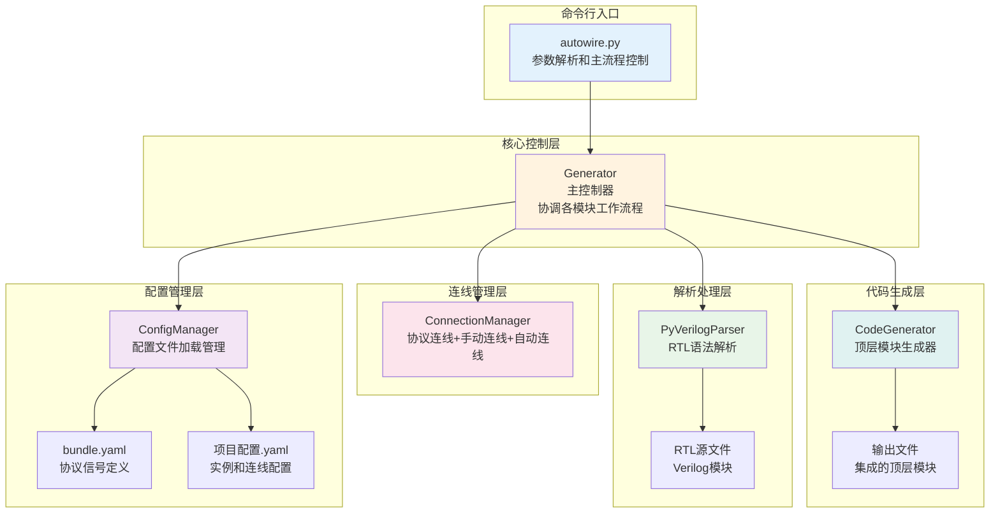

# AutoWire
[](https://opensource.org/licenses/MIT)
[](https://www.python.org/)

AutoWire 是一个基于 [PyVerilog](https://github.com/PyHDI/Pyverilog) 的 Verilog 自动连线工具。它能够自动解析 Verilog 模块，根据配置文件进行协议信号批量匹配和端口连线，最终生成顶层模块，适应于soc集成。

# 架构图


```mermaid
graph TB
    subgraph "命令行入口"
        A[autowire.py<br/>参数解析和主流程控制]
    end
    
    subgraph "核心控制层"
        B[Generator<br/>主控制器<br/>协调各模块工作流程]
    end
    
    subgraph "代码生成层"
        I[CodeGenerator<br/>顶层模块生成器]
        J[输出文件<br/>集成的顶层模块]
    end
    
    subgraph "连线管理层"
        H[ConnectionManager<br/>协议连线+手动连线+自动连线]
    end
    
    subgraph "解析处理层"
        F[PyVerilogParser<br/>RTL语法解析]
        G[RTL源文件<br/>Verilog模块]
    end
    
    subgraph "配置管理层"  
        C[ConfigManager<br/>配置文件加载管理]
        D[bundle.yaml<br/>协议信号定义]
        E[项目配置.yaml<br/>实例和连线配置]
    end
    
    A --> B
    B --> I
    B --> H
    B --> F  
    B --> C
    
    C --> D
    C --> E
    F --> G
    I --> J
    
    style A fill:#e3f2fd
    style B fill:#fff3e0
    style C fill:#f3e5f5
    style F fill:#e8f5e8
    style H fill:#fce4ec
    style I fill:#e0f2f1
```

## 安装依赖

```bash
pip install pyverilog pyyaml
```
其他：pyverilog需要预装iverilog,否则解析错误


## 快速开始 - DMA 控制器集成示例

以 DMA 控制器为例，演示 AutoWire v2.0 的完整使用流程：

### 1. 准备RTL文件

项目包含两个核心模块：
- `dma_csr.v`: DMA 配置寄存器模块（APB从设备接口）
- `dma_core.v`: DMA 数据传输核心模块（AXI主设备接口）

### 2. 创建配置文件 `vcn_dma.yaml`

```yaml
top_module: dma_top

# Global Define files (optional)  
define_files: 
#  - ./rtl/global_define.vh

# Module definitions
rtl_path:
  - ./dma_rtl/dma_csr.v
  - ./dma_rtl/dma_core.v

instances:
  - module: dma_csr
    name: u_dma_csr
  - module: dma_core
    name: u_dma_core
    parameters:
      DMA_NUM_DESC: 2

# inter-module connections
connections:
  u_dma_csr.csr_dma_version: 16'habcd

# bundle connections
bundle_con:
  - axi:
      u_dma_core.axim_*    : dma_axi4m_*
  - apb:
      u_dma_csr.*          : dma_apbs_*

# top-level output additions
top_add:
  - csr_dma_done
  - csr_dma_err
```

### 3. 运行AutoWire

```bash
python autowire.py -i vcn_dma.yaml -o ./dma_rtl_gen -d
```

参数说明：
- `-i vcn_dma.yaml`: 指定输入配置文件
- `-o ./dma_rtl_gen`: 指定输出目录
- `-d`: 启用调试模式，生成详细日志

### 4. 输出结果

AutoWire 自动生成以下文件：

#### 顶层模块 `dma_top.v`：
```verilog
module dma_top(
    // u_dma_csr ports
    input           clk,
    input           rst_n,
    input           psel,
    input           penable,
    input           pwrite,
    input   [11:0]  paddr,
    input   [31:0]  pwdata,
    output  [31:0]  prdata,
    output          pready,
    output          pslverr,

    // u_dma_core ports
    output          intr_dma_done,
    output          intr_dma_err,
    output          axim_awlock,
    output  [3:0]   axim_awcache,
    output  [2:0]   axim_awprot,
    output  [3:0]   axim_awqos,
    output  [31:0]  axim_awaddr,
...
);

wire  [31:0]  csr_dma_err_addr          ;
wire          csr_dma_err_clr           ;
wire  [1:0]   csr_dma_err_type          ;
wire  [7:0]   csr_dma_maxburst          ;
wire  [31:0]  csr_dma_single_trans_bytes;
wire          csr_dma_start             ;
wire  [1:0]   csr_dma_status            ;
wire  [31:0]  csr_dma_total_trans_bytes ;
wire  [31:0]  csr_dst_addr              ;
wire  [31:0]  csr_dst_jump_gap          ;
wire  [15:0]  csr_dst_jump_num          ;
wire  [15:0]  csr_dst_jump_state        ;
wire  [31:0]  csr_src_addr              ;
wire  [31:0]  csr_src_jump_gap          ;
wire  [15:0]  csr_src_jump_num          ;
wire  [15:0]  csr_src_jump_state        ;

// Instance: u_dma_csr (dma_csr)
dma_csr u_dma_csr (
    .clk                        (clk                       ),    // input 
    .rst_n                      (rst_n                     ),    // input 
    .psel                       (psel                      ),    // input 
    .penable                    (penable                   ),    // input 
    .pwrite                     (pwrite                    ),    // input 
    .paddr                      (paddr                     ),    // input  [11:0]
    .pwdata                     (pwdata                    ),    // input  [31:0]
    .prdata                     (prdata                    ),    // output [31:0]
    .pready                     (pready                    ),    // output
    .pslverr                    (pslverr                   ),    // output
    .csr_dma_version            (16'habcd                  ),    // input  [15:0]
    .csr_dma_start              (csr_dma_start             ),    // output
    .csr_dma_maxburst           (csr_dma_maxburst          ),    // output [7:0]
    .csr_dma_single_trans_bytes (csr_dma_single_trans_bytes),    // output [31:0]
...
);

// Instance: u_dma_core (dma_core)
dma_core u_dma_core (
    .clk                        (clk                       ),    // input 
    .rst_n                      (rst_n                     ),    // input 
    .csr_dma_single_trans_bytes (csr_dma_single_trans_bytes),    // input  [31:0]
    .csr_dma_total_trans_bytes  (csr_dma_total_trans_bytes ),    // input  [31:0]
    .csr_src_addr               (csr_src_addr              ),    // input  [31:0]
    .csr_dst_addr               (csr_dst_addr              ),    // input  [31:0]
    .csr_src_jump_num           (csr_src_jump_num          ),    // input  [15:0]
    .csr_dst_jump_num           (csr_dst_jump_num          ),    // input  [15:0]
....
);
endmodule
```

### 6. 调试信息

调试模式下生成详细日志：
```
2025-09-03 19:54:31 - INFO - Generated 44 protocol connections
2025-09-03 19:54:31 - INFO - Auto-connection completed: 81/81 ports connected
2025-09-03 19:54:31 - INFO - Processing top_add signals: ['csr_dma_done', 'csr_dma_err']  
2025-09-03 19:54:31 - INFO - Generated 51 top-level ports (including 3 top_add ports)
2025-09-03 19:54:31 - INFO - Successfully generated ./dma_rtl_gen\dma_top.v
```


### 核心算法说明

#### 1. 协议信号匹配算法
- **通配符展开**: `u_dma_core.axim_*` 匹配所有 `axim_` 前缀端口
- **协议过滤**: 基于 `bundle.yaml` 中的信号列表进行精确过滤
- **命名转换**: `axim_awaddr` → `dma_axi4m_awaddr`

#### 2. 连线优先级机制
1. **协议连线** (`bundle_con`) - 最高优先级
2. **手动连线** (`connections`) - 中等优先级  
3. **自动连线** (同名匹配) - 最低优先级

#### 3. 位宽检查和错误处理
- 自动检测端口位宽不匹配
- 支持位选择语法 `signal[7:0]`
- 支持信号拼接 `{sig1, sig2, 4'b0}`

## 命令行参数

```bash
python autowire.py [-h] [-i INPUT] [-o OUTPUT] [-b BOUNDING] [-d] [--version]

参数说明:
  -h, --help            显示帮助信息并退出
  -i INPUT, --input     输入YAML配置文件 (默认: vcn.yaml)
  -o OUTPUT, --output   输出目录或文件路径 (默认: .)
  -b BOUNDING, --bounding 协议信号定义文件 (默认: bundle.yaml)  
  -d, --debug           启用调试模式，保存详细日志和中间文件
  --version             显示版本信息
```


### 连接语法支持

| 连接类型 | 语法示例 | 说明 |
|---------|---------|------|
| 常量连接 | `1'b1`, `16'habcd`, `32'd100` | 直接常量值 |
| 位选择 | `bus[7:0]`, `data[15]` | 信号位选择 |
| 信号拼接 | `{sig1, sig2, 4'b0}` | 多信号拼接 |
| 悬空端口 | (留空) | 端口不连接 |
| 表达式 | `~reset_n`, `data + 1` | 简单表达式 |


## 项目结构

```
autowire-master/
├── autowire.py                # 主入口脚本
├── bundle.yaml             # 协议信号定义文件
├── vcn_dma.yaml              # DMA配置示例
├── src/                      # 核心源代码
│   ├── generator.py          # 主控制器
│   ├── config_manager.py     # 配置管理
│   ├── parser.py             # Verilog解析器
│   ├── connection_manager.py # 连线管理
│   ├── code_generator.py     # 代码生成器
│   ├── data_structures.py    # 数据结构定义
│   └── logger.py             # 日志管理
├── dma_rtl/                  # 示例RTL文件
│   ├── dma_csr.v            # DMA配置寄存器模块
│   └── dma_core.v           # DMA核心模块
└── dma_rtl_gen/             # 输出目录示例
    ├── dma_top.v            # 生成的顶层模块
    └── *.log                # 调试日志文件
```

## 更新日志

### v2.0.0 (当前版本 - 重构版本)
- 1: 采用模块化设计，提高代码可维护性
- 2: 改进AXI/APB/AHB协议信号匹配算法  
- 3: 完善二维数组端口解析和连接功能
- 4: 新增详细日志和中间文件保存
- 5: 增强错误检测和异常处理机制
- 6: 支持更复杂的连接表达式和参数传递

---

**AutoWire v2.0** 


