# AutoWire
[](https://opensource.org/licenses/MIT)
[](https://www.python.org/)

AutoWire v2.0 是一个基于 [PyVerilog](https://github.com/PyHDI/Pyverilog) 的 Verilog SOC 自动连线工具。它能够自动解析 Verilog 模块，根据配置文件进行协议信号批量匹配和端口连线，最终生成顶层集成模块。

## 核心特性

- 🔧 **智能连线**: 协议信号自动识别（AXI、APB、AHB等）+ 同名信号匹配
- 📝 **YAML配置**: 直观的配置文件，支持参数化实例和复杂连接表达式  
- 🎯 **精确解析**: 基于 PyVerilog 的 Verilog 语法解析，支持二维数组端口
- 🐛 **调试友好**: 详细日志输出，中间配置文件保存，临时文件可选保留
- 🚀 **模块化架构**: 重构后的 v2.0 版本，组件化设计便于扩展


## 安装依赖

```bash
pip install pyverilog pyyaml
```
其他：pyverilog需要预装iverilog,否则解析错误


## 快速开始 - DMA 控制器集成示例

以 DMA 控制器为例，演示 AutoWire v2.0 的完整使用流程：

### 1. 准备RTL文件

项目包含两个核心模块：
- `dma_csr.v`: DMA 配置寄存器模块（APB从设备接口）
- `dma_core.v`: DMA 数据传输核心模块（AXI主设备接口）

### 2. 创建配置文件 `vcn_dma.yaml`

```yaml
top_module: dma_top

# RTL 源文件路径
rtl_path:
  - ./dma_rtl/dma_csr.v
  - ./dma_rtl/dma_core.v

# 模块实例定义
instances:
  - module: dma_csr
    name: u_dma_csr
  - module: dma_core
    name: u_dma_core
    parameters:
      DMA_NUM_DESC: 2          # 参数化配置：2个描述符

# 手动连线（常量连接）
connections:
  u_dma_csr.csr_dma_version: 16'habcd  # DMA版本号

# 协议信号自动连线
bounding_con:
  - axi:                       # AXI4协议信号批量连接
      u_dma_core.axim_*: dma_axi4m_*
  - apb:                       # APB协议信号批量连接  
      u_dma_csr.*: dma_apbs_*
```

### 3. 运行AutoWire

```bash
python autowire.py -i vcn_dma.yaml -o ./dma_rtl_gen -d
```

参数说明：
- `-i vcn_dma.yaml`: 指定输入配置文件
- `-o ./dma_rtl_gen`: 指定输出目录
- `-d`: 启用调试模式，生成详细日志

### 4. 输出结果

AutoWire 自动生成以下文件：

#### 顶层模块 `dma_top.v`：
```verilog
module dma_top(
    // APB从设备接口（CSR模块）
    input           pclk,
    input           presetn,
    input           dma_apbs_psel,
    input           dma_apbs_penable,
    input           dma_apbs_pwrite,
    input   [11:0]  dma_apbs_paddr,
    input   [31:0]  dma_apbs_pwdata,
    output  [31:0]  dma_apbs_prdata,
    output          dma_apbs_pready,

    // AXI4主设备接口（数据传输）
    input           clk,
    input           rst_n,
    output  [31:0]  dma_axi4m_awaddr,
    output  [7:0]   dma_axi4m_awlen,
    // ... 完整的AXI4信号
);

// 内部连线信号（自动声明）
wire  [31:0]  csr_desc_src_addr [1:0];     // 数组信号
wire  [31:0]  csr_desc_dst_addr [1:0]; 
wire  [7:0]   csr_dma_maxburst;
// ... 更多内部信号

// CSR模块实例化
dma_csr u_dma_csr (
    .pclk              (pclk               ),
    .presetn           (presetn            ),
    .psel              (dma_apbs_psel      ),
    .csr_dma_version   (16'habcd           ),  // 常量连接
    // ... APB协议信号自动连接
);

// DMA核心模块实例化（参数化）
dma_core #(
    .DMA_NUM_DESC(2)        // 参数自动传递
) u_dma_core (
    .clk               (clk                ),
    .rst_n             (rst_n              ),
    .axim_awaddr       (dma_axi4m_awaddr   ),
    // ... AXI协议信号自动连接
    .csr_desc_src_addr (csr_desc_src_addr  ), // 内部信号连接
);

endmodule
```

### 5. 关键特性演示

✅ **协议信号自动识别**: 
- `axim_*` → `dma_axi4m_*` (36个AXI信号)
- `psel, paddr, pwdata...` → `dma_apbs_*` (7个APB信号)

✅ **数组端口支持**: 
- `csr_desc_src_addr[1:0]` 正确处理

✅ **参数化实例**: 
- `DMA_NUM_DESC: 2` 自动传递到模块

✅ **常量连接**: 
- 版本号 `16'habcd` 直接连接

✅ **自动连线**: 
- 81个端口全部自动连接，无需手动配置

### 6. 调试信息

调试模式下生成详细日志：
```
2025-09-03 19:54:31 - INFO - Generated 44 protocol connections
2025-09-03 19:54:31 - INFO - Auto-connection completed: 81/81 ports connected  
2025-09-03 19:54:31 - INFO - Generated 48 top-level ports
2025-09-03 19:54:31 - INFO - Successfully generated ./dma_rtl_gen\dma_top.v
```

## 系统架构

AutoWire v2.0 采用模块化架构设计，主要包含以下核心组件：

### 模块关系架构图


### 处理流程图

```mermaid
flowchart TD
    A[开始] --> B[解析命令行参数]
    B --> C[检查输入文件]
    C --> D[初始化AutoWireGenerator]
    
    D --> E[配置加载阶段]
    E --> E1[加载主YAML配置]
    E1 --> E2[加载协议信号定义bounding.yaml]
    E2 --> E3[初始化各组件]
    
    E3 --> F[解析阶段]
    F --> F1[解析RTL文件发现模块]
    F1 --> F2[使用PyVerilog提取端口信息]
    F2 --> F3[处理参数化实例]
    F3 --> F4[创建Instance对象列表]
    
    F4 --> G[连线阶段]
    G --> G1[协议连线处理bounding_con]
    G1 --> G1A[通配符匹配axim_* → dma_axi4m_*]
    G1A --> G1B[生成中间配置文件]
    G1B --> G2[手动连线处理connections]
    G2 --> G2A[常量连接16'habcd]
    G2A --> G2B[信号连接和位选择]
    G2B --> G3[自动连线阶段]
    G3 --> G3A[同名信号匹配]
    G3A --> G3B[位宽检查]
    
    G3B --> H[代码生成阶段]
    H --> H1[生成顶层端口列表]
    H1 --> H2[生成内部信号声明]
    H2 --> H3[生成实例化代码]
    H3 --> H4[处理参数传递]
    H4 --> H5[生成端口连接]
    H5 --> H6[输出Verilog文件]
    
    H6 --> I[清理和完成]
    I --> I1[清理PyVerilog缓存文件PLY]
    I1 --> I2{调试模式?}
    I2 -->|是| I3[保留中间文件和日志]
    I2 -->|否| I4[清理临时文件] 
    I3 --> J[完成]
    I4 --> J
    
    style A fill:#e1f5fe
    style J fill:#c8e6c9
    style G1A fill:#fff3e0
    style G2A fill:#fff3e0
    style G3A fill:#fff3e0
```



### 数据流向图

```mermaid
flowchart LR
    subgraph "输入数据"
        A1[YAML配置文件]
        A2[bounding.yaml]
        A3[RTL源文件]
    end
    
    subgraph "中间数据结构"
        B1[Instance对象<br/>模块实例信息]
        B2[Port对象<br/>端口详细信息]
        B3[WireInfo对象<br/>连线映射关系]
    end
    
    subgraph "处理阶段"
        C1[协议信号匹配<br/>axim_* → dma_axi4m_*]
        C2[手动连线处理<br/>常量和复杂表达式]
        C3[自动连线<br/>同名信号匹配]
    end
    
    subgraph "输出结果"
        D1[顶层Verilog模块]
        D2[中间配置文件yaml]
        D3[调试日志文件]
    end
    
    A1 --> B1
    A2 --> C1
    A3 --> B2
    
    B1 --> C1
    B2 --> C1
    C1 --> B3
    
    B3 --> C2
    C2 --> B3
    
    B3 --> C3
    C3 --> B3
    
    B1 --> D1
    B2 --> D1  
    B3 --> D1
    
    C1 --> D2
    C1 --> D3
    C2 --> D3
    C3 --> D3
    
    style A1 fill:#e1f5fe
    style A2 fill:#e1f5fe
    style A3 fill:#e1f5fe
    style D1 fill:#c8e6c9
    style D2 fill:#fff9c4
    style D3 fill:#f3e5f5
```



### 核心算法说明

#### 1. 协议信号匹配算法
- **通配符展开**: `u_dma_core.axim_*` 匹配所有 `axim_` 前缀端口
- **协议过滤**: 基于 `bounding.yaml` 中的信号列表进行精确过滤
- **命名转换**: `axim_awaddr` → `dma_axi4m_awaddr`

#### 2. 连线优先级机制
1. **协议连线** (`bounding_con`) - 最高优先级
2. **手动连线** (`connections`) - 中等优先级  
3. **自动连线** (同名匹配) - 最低优先级

#### 3. 位宽检查和错误处理
- 自动检测端口位宽不匹配
- 支持位选择语法 `signal[7:0]`
- 支持信号拼接 `{sig1, sig2, 4'b0}`

## 命令行参数

```bash
python autowire.py [-h] [-i INPUT] [-o OUTPUT] [-b BOUNDING] [-d] [--version]

参数说明:
  -h, --help            显示帮助信息并退出
  -i INPUT, --input     输入YAML配置文件 (默认: vcn.yaml)
  -o OUTPUT, --output   输出目录或文件路径 (默认: .)
  -b BOUNDING, --bounding 协议信号定义文件 (默认: bounding.yaml)  
  -d, --debug           启用调试模式，保存详细日志和中间文件
  --version             显示版本信息
```

**使用示例：**

```bash
# DMA控制器集成（推荐）
python autowire.py -i vcn_dma.yaml -o ./dma_rtl_gen -d

# CPU子系统集成，使用自定义协议文件
python autowire.py -i cpu_config.yaml -b custom_protocols.yaml -o cpu_top.v

# 快速生成，输出到当前目录
python autowire.py -i simple_config.yaml

# 调试模式，查看详细处理过程
python autowire.py -i debug_config.yaml -o ./debug -d
```

## 配置文件详解

### 主配置文件格式

```yaml
# 基本配置
top_module: dma_top                    # 生成的顶层模块名

# 宏定义文件 (可选)
define_files:
  - ./rtl/defines.vh                   # 全局宏定义

# RTL 源文件路径
rtl_path:
  - ./dma_rtl/dma_csr.v               # 支持相对路径
  - ./dma_rtl/dma_core.v              # 自动发现模块

# 模块实例定义
instances:
  - module: dma_csr                    # 模块名（必须与RTL中一致）
    name: u_dma_csr                    # 实例名
  - module: dma_core 
    name: u_dma_core
    parameters:                        # 参数化配置
      DMA_NUM_DESC: 2
      DATA_WIDTH: 64

# 手动连线配置
connections:
  u_dma_csr.csr_dma_version: 16'habcd # 常量连接
  u_dma_core.enable: 1'b1              # 使能信号
  u_debug.test_port:                   # 悬空连接（留空）
  u_mux.sel: "2'b01"                   # 字符串形式常量

# 协议信号自动连线
bounding_con:
  - axi:                               # 协议类型
      u_dma_core.axim_*: dma_axi4m_*  # 通配符匹配
  - apb:
      u_dma_csr.*: dma_apbs_*         # 全端口匹配
```

### 协议信号定义文件 (`bounding.yaml`)

```yaml
protocol_signals:
  # AXI4 协议完整信号列表
  axi:
    - awaddr, awlen, awsize, awburst, awvalid, awready
    - wdata, wstrb, wlast, wvalid, wready
    - bresp, bvalid, bready
    - araddr, arlen, arsize, arburst, arvalid, arready
    - rdata, rresp, rlast, rvalid, rready
    - awid, bid, arid, rid
    - awlock, awcache, awprot, awqos
    - arlock, arcache, arprot, arqos
    
  # APB 协议信号列表
  apb:
    - paddr, pwdata, prdata
    - pwrite, psel, penable, pready
    - pslverr                          # 可选错误信号
    
  # AHB 协议信号列表  
  ahb:
    - haddr, hwrite, hsize, hburst, htrans
    - hwdata, hrdata, hready, hresp
    - hprot, hmastlock, hsel
```

### 连接语法支持

| 连接类型 | 语法示例 | 说明 |
|---------|---------|------|
| 常量连接 | `1'b1`, `16'habcd`, `32'd100` | 直接常量值 |
| 位选择 | `bus[7:0]`, `data[15]` | 信号位选择 |
| 信号拼接 | `{sig1, sig2, 4'b0}` | 多信号拼接 |
| 悬空端口 | (留空) | 端口不连接 |
| 表达式 | `~reset_n`, `data + 1` | 简单表达式 |

## 常见问题与解决方案

### 1. 模块解析失败
```
ERROR - Module cpu_core not found in RTL files
```
**解决方案：**
- 检查 `rtl_path` 中文件路径是否正确
- 确认模块名与文件中 `module` 声明一致
- 使用绝对路径避免路径问题

### 2. 协议信号不匹配
```
WARNING - No protocol signals matched for u_cpu.ahb_*
```
**解决方案：**
- 检查端口命名是否包含协议信号名
- 验证 `bounding.yaml` 中协议信号定义
- 使用调试模式 `-d` 查看匹配详情

### 3. 位宽不匹配
```
WARNING - Width mismatch for wire data_bus: input=32, output=16
```
**解决方案：**
- 使用位选择：`data_bus[15:0]`
- 使用拼接：`{16'b0, narrow_signal}`
- 检查模块定义确保位宽一致

### 4. 调试技巧
```bash
# 启用详细调试
python autowire.py -i config.yaml -o ./debug -d

# 检查生成的中间配置文件
cat debug/config_intermediate.yaml

# 查看详细日志
tail -f debug/autowire_debug_*.log
```

## 项目结构

```
autowire-master/
├── autowire.py                # 主入口脚本
├── bounding.yaml             # 协议信号定义文件
├── vcn_dma.yaml              # DMA配置示例
├── src/                      # 核心源代码
│   ├── generator.py          # 主控制器
│   ├── config_manager.py     # 配置管理
│   ├── parser.py             # Verilog解析器
│   ├── connection_manager.py # 连线管理
│   ├── code_generator.py     # 代码生成器
│   ├── data_structures.py    # 数据结构定义
│   └── logger.py             # 日志管理
├── dma_rtl/                  # 示例RTL文件
│   ├── dma_csr.v            # DMA配置寄存器模块
│   └── dma_core.v           # DMA核心模块
└── dma_rtl_gen/             # 输出目录示例
    ├── dma_top.v            # 生成的顶层模块
    └── *.log                # 调试日志文件
```

## 更新日志

### v2.0.0 (当前版本 - 重构版本)
- ✅ **架构重构**: 采用模块化设计，提高代码可维护性
- ✅ **协议优化**: 改进AXI/APB/AHB协议信号匹配算法  
- ✅ **二维数组**: 完善二维数组端口解析和连接功能
- ✅ **调试增强**: 新增详细日志和中间文件保存
- ✅ **错误处理**: 增强错误检测和异常处理机制
- ✅ **配置灵活**: 支持更复杂的连接表达式和参数传递

---

## 许可证

本项目基于 MIT 许可证开源。详见 [LICENSE](LICENSE) 文件。

## 反馈与支持

- 🐛 **问题报告**: 请通过 GitHub Issues 提交
- 💡 **功能建议**: 欢迎提交 Pull Request
- 📧 **技术支持**: 查看调试日志或联系维护者

**AutoWire v2.0** - 让Verilog模块集成更简单、更智能！
